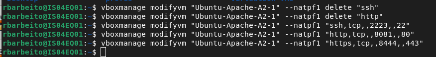
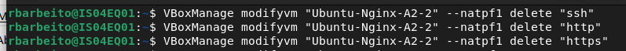
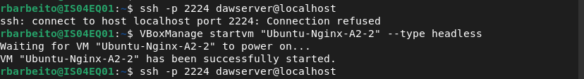
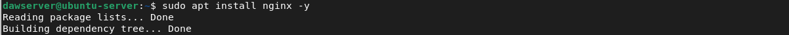
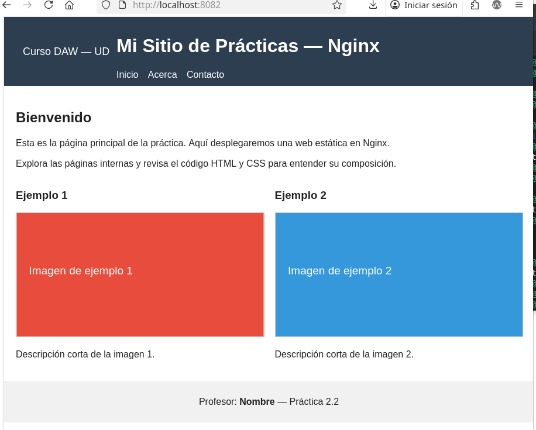

# Actividad 2.2 Instalación y despliegue on Nginx
___

# 1. Preparación de la MV

# 1.1. Creación de la MV 


# 1.2. Configuración de red



# 1.3. Acceso por ssh a la MV


# 2. Preparación del entorno

# 2.1. Instalación Nginx 



# 2.2. Configuración del firewall


# 2.2. Configuración del estado de Nginx


# 3.Configuración del blque servidor

# 3.2. Desactivación del sitio por defecto
Se crea un archivo de configuración en **/etc/nginx/sites-available/sitio_ejemplo**

```nginx
server {
    listen 80;
    server_name _;
    root /var/www/sitio_ejemplo;
    index index.html;
    location / {
        try_files $uri $uri/ =404;
    }
}
```


# 3.2. Desactivación del sitio por defecto


# Resultado Final
